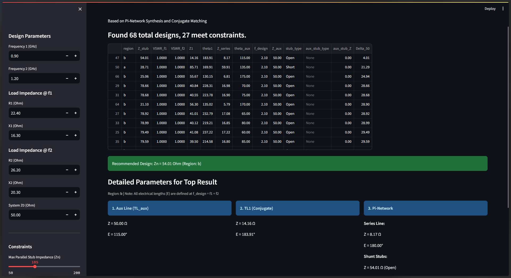

# 双频阻抗匹配设计工具 (Dual Band Matching Designer)
[English](./README.md) | [中文文档](./README_CN.md)
这是一个基于 Streamlit 的双频阻抗匹配网络设计工具，采用 Pi 型网络综合与共轭匹配技术。

## 功能特性

- **双频匹配**: 支持任意两个频率点的共轭匹配计算。
- **参数扫描**: 自动扫描辅助传输线长度（0-180°），寻找满足方程解的最佳方案。
- **交互式筛选**: 可根据最大阻抗（Zn）等加工约束条件筛选设计方案。
- **详细报告**: 生成包含所有微带线电长度、阻抗及 VSWR 的详细参数表。

## Streamlit Community Cloud (免费在线共享)

此应用部署到 Streamlit 云端，方便分享给他人使用。
[点击进入Streamlit WebApp](https://asanilo-dual-band-matcher-streamlit-app-ghopyu.streamlit.app/)

## 本地运行

如果您想在本地电脑上运行：

1.  安装依赖库:
    ```bash
    pip install -r requirements.txt
    ```
2.  启动应用:
    ```bash
    streamlit run streamlit_app.py
    ```
